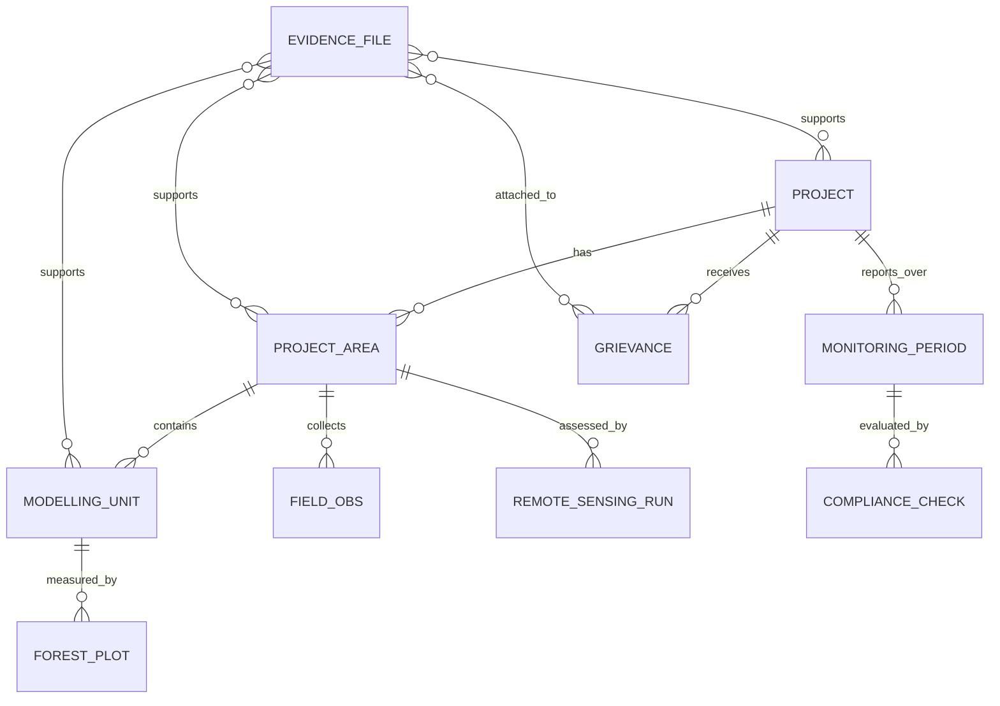

# Strategi för Gold Standard MRV med fjärranalys och fältdata via Mergin Maps och en automatiserad PostGIS-pipeline

## Executive summary

Den här rapporten beskriver en revisionsredo MRV-strategi (Monitoring, Reporting & Verification) som kombinerar fältdata insamlad via **Mergin Maps** med en automatiserad, händelsedriven dataplattform (PostGIS/GeoPackage) och “Gemini-assisterad” standard- och regelefterlevnadsanalys. Strategin är utformad för att uppfylla centrala Gold Standard-krav för (i) avgränsning av projekt- och stödjande “relaterade” områden, (ii) fjärranalysbaserad skog/icke‑skog‑bedömning och (iii) spårbarhet/audit trail för verifiering och offentlig transparens. citeturn31view2turn31view1turn31view0turn34view0

**Intervjupitch (30 sekunder)**  
Jag bygger en “audit-by-design”-MRV‑pipeline där all fältdata (gränser, MU/plotar, foton, markrättigheter, intressentdialog och klagomål) samlas in i Mergin-formulär, synkas tvåvägs till PostGIS och triggar automatiska QA‑kontroller, gap‑analyser och rapportpaket för VVB-verifiering. Standardsidan hanteras med en retrieval‑baserad Gemini‑assistent som tolkar Gold Standard‑klausuler, mappar dem till konkreta datakrav och skriver ut förslag till övervakningsplan/rapporttext – men alltid med tydliga mänskliga granskningspunkter. Resultatet är snabbare revision, bättre datakvalitet och en obruten kedja av bevis från land till certifierad påverkan. citeturn3search0turn8view0turn31view0turn34view0

**Varför detta är “Gold Standard-kompatibelt” i kärnan**  
- Gold Standard kräver att **övervaknings- och rapportplanen** specificerar *parameter/metric, frekvens, insamlingsmetod/ansvariga och QA/QC* – vilket direkt kan operationaliseras till obligatoriska formulärfält + automatiska valideringar. citeturn8view0  
- För LUF/A/R krävs **fjärranalysprotokoll** (scener ≥10 år före start + vid start, redovisning av sensor/metod, 90% min. klassnoggrannhet, shapefiler för eligible area + accuracy‑punkter). citeturn31view2turn13view1  
- Vid verifiering måste VVB kunna bekräfta en **audit trail** med underlag, täckning över hela perioden och att endast *verifierbara bevis* ligger till grund för certifiering. citeturn31view0  
- Safeguarding‑underlag ska i regel **publiceras i Impact Registry** (med ev. maskning), vilket driver krav på evidenshantering, metadata och sekretessflöden. citeturn34view0  
- SDG-indikatorer i SDG Impact Tool får **inte** manuellt “överstyras”; indikatorval måste vara spårbart och verifierbart – vilket stärker behovet av automatiserade, regelstyrda datakällor. citeturn35view0turn37view2  

**Antaganden (uttalade för transparens)**  
- Fokus är **LUF/Afforestation–Reforestation** (A/R) eftersom United Eco Solutions beskriver storskalig agroforestry/restoration i Kongo-bäckenet samt att de är listade i Gold Standard-registret; extern profilering anger “Methodologies: Reforestation” och “Registry: Gold Standard”. Exakt projektdokumentation och metodval kan dock inte verifieras här eftersom Gold Standard-registry-sidan kräver JavaScript i visningen; därför markeras metod-ID för United Eco Solutions som *inte slutgiltigt bekräftat*. citeturn23view0turn23view2turn24view0turn5view0  
- Designen görs modulär så att samma pipeline kan utökas till AGR/SOC‑moduler och dMRV‑pilotkrav. citeturn31view1turn12view0  
- Rapporten är daterad **2 mars 2026**; Gold Standard har uttryckligen kommunicerat att icke‑Paris‑anpassade metodiker ska fasas ut och att Paris‑anpassade versioner ska användas för **vintage 2026**. Detta behandlas som en aktiv förändringsrisk. citeturn16view0turn16view1turn26view0  

## Gold Standard MRV-krav för fjärranalys och områdesavgränsning

### Trolig metodik för United Eco Solutions och vad som behöver bevisas

United Eco Solutions beskriver sina aktiviteter som “large-scale agroforestry and ecosystem restoration” med spårbarhet “from issued credits to land”, och att de är listade i Gold Standard‑registret. citeturn23view0turn23view2 En extern marknadsprofil anger metodtyp “Reforestation” och mekanism “Removal”. citeturn24view0 Sammantaget pekar detta mot Gold Standard LUF med A/R‑inriktning och därmed användning av **A/R GHG emission reduction & sequestration methodology** samt **LUF Activity Requirements** (som explicit täcker A/R och AGR). citeturn27view0turn13view2

I A/R‑metodiken framgår också att projekt kan inkludera **agroforestry** (jordbruk i kombination med träd) inom A/R‑ramen, vilket matchar deras beskrivning. citeturn27view0  
Det centrala MRV‑beviset blir då:

- **Att eligible area inte var skog** (enligt värdlandets forest definition eller FAO‑fallback) *10 år före start och vid start*. citeturn31view2turn27view0turn13view3  
- Att gränser, eligible areas och **Modelling Units** (MU) är korrekt avgränsade och spårbara, inklusive relaterade lager för skyddade områden, vatten, kultur/urfolk, “affected people” m.m. (krav på GIS‑vektorlager). citeturn31view1  
- Att skogsinventering (field plots) och/eller andra mätningar styrker biomassamodeller och att precision uppnås (±20% vid 90% konfidens) samt att inventering upprepas minst inför varje Performance Certification. citeturn28view0  

### Gold Standard-protokoll som direkt styr fjärranalys och “relaterade områden”

**Fjärranalys: forest/non‑forest assessment (LUF Annex C)**  
Gold Standard kräver ett reproducerbart upplägg: rapportera datatyp (sensor, upplösning, källa), två tidpunkter (≥10 år före start + vid start), hur moln/skuggor hanteras (konservativt, och om ground‑truthing görs får endast besökta ytor räknas; sampling är inte tillåtet i den delen), skapa shapefile för eligible area och shapefile för accuracy‑punkter och uppnå ca **90% minsta klassnoggrannhet**. citeturn31view2turn13view1

**Relaterade områden: obligatoriska GIS‑lager (LUF 4.1.3)**  
Alla LUF‑projekt ska lämna in GIS‑vektorlager för bl.a. Project region, Project area, Eligible areas, Individual MUs, infrastruktur, vatten, skyddade områden, biodiversitetsytor, var berörda personer finns samt områden av kulturell/urfolksmässig betydelse. citeturn31view1

**Projektarea och fältverifierbarhet**  
LUF definierar projektarea som en yta(yta) med tydliga gränser och uttryckliga långsiktiga mål, och anger att gränser ska vara “clearly distinguishable in the field”. citeturn13view2 Det driver ett MRV‑krav på fältbevis (t.ex. gränsmarkeringar, hörnpunkter, foton, sign‑off) – inte bara GIS‑polygoner.

### Revisionslogik: audit trail, transparens och digitala verktyg

**Audit trail och verifierbara bevis**  
Vid verifiering ska VVB bekräfta en audit trail som innehåller “evidence and records” för att validera/invalidiera rapporterade siffror, inklusive källdokument bakom antaganden; och VVB får bara certifiera reduktioner/upptag som bygger på verifierbara bevis. citeturn31view0 Detta är ett starkt argument för en datamodell som separerar rådata, processade resultat och rapporterade indikatorer – och som hashar och versionssätter bilagor.

**Safeguarding och offentlig publicering av evidens**  
Safeguarding-krav anger att stödjande dokument och evidens ska göras offentligt tillgängligt i Impact Registry (med möjlighet till redigerad version vid konfidentialitet). citeturn34view0 Därför bör pipeline automatiskt skapa två paket: (1) full evidens för VVB och (2) publiceringspaket med rödflaggningslogik för sekretess.

**Kontinuerlig feedback/klagomekanism**  
Stakeholderkrav kräver formell input/grievance‑mekanism under hela livslängden samt att projektet ska registrera alla kommentarer och skicka skriftligt mottagningskvitto (utom anonyma). citeturn32view0 Det bör modelleras som en förstaklass‑entitet (tickets) med SLA, status och evidensbilagor.

**SDG Impact Tool: inga manuella overrides + separat beräkning av SDG13**  
Gold Standard förbjuder manuell override av indikatorer i SDG Impact Tool. citeturn35view0 Samtidigt anger Gold Standards support att emissionsberäkningar (SDG13) **inte** görs i SDG Impact Tool utan ska beräknas separat och rapporteras i PDD/MR eller separat beräkningsark. citeturn37view2 Detta styr arkitekturen: pipeline måste kunna producera både “SDG‑tool‑kompatibla” indikatorvärden och separata emissions-/removal‑kalkylark.

**Digital assurance/inlämning**  
Gold Standard använder en digital Assurance Platform där nya project reviews (från 5 dec 2024) lämnas in och där dokumenthantering/workflows sker; plattformen är integrerad med registret och används för att boka och hantera reviews. citeturn37view0turn37view1 Praktiskt betyder det att “slutleveransen” från pipeline bör vara ett versionsatt dokumentpaket som är lätt att ladda upp och spåra.

### Prioriterad dokumentlista med nyckelklausuler och primärkällor

Tabellen nedan prioriterar dokument som direkt påverkar design av fältformulär, fjärranalys‑MRV och auditability. “RU”-prefix i Gold Standard‑biblioteket syftar ofta på *Rule Update*, inte ryska översättningar; jag hittade inga tydliga ryska språkversioner av dessa standarddokument i primärkällorna och markerar därför “ryska: unspecified”. citeturn15search2turn29search7

| Dokument (ID, version) | Klausuler att operationalisera | Kort nyckelcitat (≤25 ord) | Ryska |
|---|---|---|---|
| Principles & Requirements (101 v2.1) citeturn8view0turn7view1 | 4.1.43–4.1.44 (Monitoring & Reporting Plan), kartkrav, NC‑rapportering | “For each monitored parameter… (a) metric… (b) frequency… (c) method… (d) quality control…” citeturn8view0 | Unspecified |
| LUF Activity Requirements (203 v1.2.1) citeturn31view1turn31view2turn13view2 | 4.1.3 GIS‑lager; Annex C fjärranalys; eligibility “no deforestation” | “Remote sensing scenes should be dated… at least 10 years before… and at project start date.” citeturn31view2 | Unspecified |
| A/R Methodology (403 v2.1) citeturn27view0turn28view0 | Applicability, MU‑definition, forest inventory‑frekvens, precision | “Forest inventories shall be repeated at minimum before every Performance Certification.” citeturn28view0 | Unspecified |
| Stakeholder Consultation (102 v2.1) citeturn32view0 | Continuous grievance; logg + acknowledgement; 2 rundor | “All projects shall set up… grievance mechanism… record all comments… send a written acknowledgement…” citeturn32view0 | Unspecified |
| Safeguarding Principles (103 v2.1) citeturn34view0 | Evidens till VVB + offentlig publicering, land tenure | “Supporting documents and evidence shall be made publicly available on the Impact Registry…” citeturn34view0 | Unspecified |
| Validation & Verification Standard (113 v2.0) citeturn31view0turn9view0 | Audit trail‑krav; endast verifierbara bevis | “VVB shall confirm… audit trail… VVB shall only certify… based on verifiable evidence.” citeturn31view0 | Unspecified |
| Monitoring Indicator Selection (118 v1.0) citeturn35view0 | Inga manuella overrides; spårbart och verifierbart indikatorval | “Manual entry or override of these indicators is strictly prohibited.” citeturn35view0 | Unspecified |
| dMRV Pilot Requirements (pilot 0.1) citeturn12view0turn25search24 | Datahantering (storage/access/retrieval/backup), alternativa issuance tracks | “Project developer… data management procedures, including data storage, access, retrieval, and backup.” citeturn12view0 | Unspecified |
| TEMI/TREE‑ACCURATE (pilotinitiativ) citeturn36view0turn36view1 | Framtida EO‑biomassa‑MRV: accuracy/uncertainty, sänka fältkostnader | “Protocol… use remote sensing of tree biomass to measure accuracy and uncertainty.” citeturn36view0 | Unspecified |

**Länkar till originalkällor (primärt globalgoals.goldstandard.org + Gold Standard help)**
```text
https://globalgoals.goldstandard.org/standards/101_V2.1_PAR_Principles-Requirements.pdf
https://globalgoals.goldstandard.org/standards/203_V1.2.1_AR_LUF-Activity-Requirements.pdf
https://globalgoals.goldstandard.org/standards/403_V2.1_LUF_AR-Methodology-GHGs-emission-reduction-and-Sequestration-Methodology.pdf
https://globalgoals.goldstandard.org/standards/102_V2.1_PAR_Stakeholder-Consultation-Requirements.pdf
https://globalgoals.goldstandard.org/standards/103_V2.1_PAR_Safeguarding-Principles-Requirements.pdf
https://globalgoals.goldstandard.org/standards/113_V2.0_PAR_Validation-and-Verification-Standard.pdf
https://globalgoals.goldstandard.org/standards/118_V1.0_PAR_Requirements-for-Monitoring-Indicator-Selection.pdf
https://globalgoals.goldstandard.org/standards/DMRV-Programme-DMRV-Requirements-pilot-v0.1.pdf
https://globalgoals.goldstandard.org/pilot-tree-and-ecosystem-monitoring-initiative-temi/
https://goldstandardhelp.freshdesk.com/support/solutions/articles/44002522554-digital-sdg-impact-tool
https://goldstandardhelp.freshdesk.com/support/solutions/articles/44002774333-gold-standard-assurance-platform
https://goldstandardhelp.freshdesk.com/support/solutions/articles/44002455549-gold-standard-impact-registry
```

## Kravkarta: Gold Standard → required fält i Mergin-formulär

Kravkartan nedan är avsedd att bli en **“single source of truth”** mellan standardtext och fältinsamling. Den är byggd för LUF/A/R men kan utökas.

| Gold Standard‑krav (kort) | Fält i Mergin‑form (minsta uppsättning) | Exempelvärden | Evidenstyp | Frekvens |
|---|---|---|---|---|
| Project area måste vara fält‑identifierbar citeturn13view2 | `project_area_id`, `boundary_marker_present`, `boundary_marker_photo[]`, `corner_point_id`, `gps_accuracy_m` | `PA-001`, `yes`, foto på markering, `CP-NE-01`, `3.2` | Foto + GNSS‑metadata | Vid etablering + vid större ändring |
| GIS‑lager: Project region/area/eligible/MU/infrastruktur/vatten/skydd/biodiv/affected people/kultur/urfolk citeturn31view1 | `feature_type` (enum), `geom`, `name`, `source`, `capture_method`, `notes_photo[]` | `protected_area`, polygon, `Salonga buffer`, `UNESCO map`, `digitized`, foto | Vector + källmetadata | Vid design, uppdateras vid ändring |
| Fjärranalys: scener ≥10 år före + vid start, sensor/resolution/metod, molnmask, shapefile eligible + accuracy points citeturn31view2turn13view1 | (I “Remote Sensing QA”-form) `scene_id`, `scene_date`, `sensor`, `resolution_m`, `preprocess_method`, `cloud_mask_area_ha`, `eligible_area_export_ref`, `accuracy_points_export_ref`, `overall_accuracy_pct` | `Landsat8_2014-06-01`, `2014-06-01`, `Landsat 8`, `30`, `RF`, `124.5`, `eligible_2024.gpkg`, `accpts_2024.gpkg`, `91.2` | Rapport + dataexport | Vid design; uppdateras vid re‑design/ny yta |
| Moln/skugga: konservativt; ground‑truthing får bara inkludera besökta ytor, ingen sampling citeturn31view2 | `cloud_shadow_polygon_id`, `visited`, `visit_tracklog[]`, `visit_photo[]`, `landcover_observed` | `CS-17`, `yes`, GPX, foton, `non-forest` | Spårlogg + foto | Vid behov (molncase) |
| Min. klassnoggrannhet ~90% per klass citeturn13view1 | `confusion_matrix_file`, `class_accuracy_forest`, `class_accuracy_nonforest` | CSV + `0.92`, `0.90` | Beräkningsfil | Vid RS‑analys |
| Monitoring plan: parameter, frekvens, metod/ansvar, QA/QC citeturn8view0 | `parameter_code`, `metric`, `frequency`, `collector_role`, `collection_method`, `qc_method` | `SOC_PLOT`, `tC/ha`, `annual`, `field_team`, `soil cores`, `duplicates+lab QA` | Plan + operativa loggar | Enligt MP |
| Forest inventory: upprepas minst inför varje Performance Certification; precision ±20% @90% CI citeturn28view0 | `plot_id`, `mu_id`, `dbh_cm[]`, `height_m[]`, `species`, `measurement_date`, `team`, `qc_remeasure_plot` | `P-0102`, `MU-07`, DBH‑lista, `Wenge`, datum, `Team A`, `yes` | Fältprotokoll + foto + lab | Minst per verifikationscykel |
| Stakeholder grievance: formellt system; logga alla kommentarer + skriftlig kvittens citeturn32view0 | `ticket_id`, `channel`, `anonymous`, `description`, `received_at`, `ack_sent_at`, `status`, `resolution`, `evidence[]` | `GR-2026-014`, `in-person`, `no`, text, tider, `resolved`, åtgärd, bilagor | Ticketlogg | Löpande |
| Safeguarding: evidens till VVB + publicering på Impact Registry (rödaktning vid behov) citeturn34view0 | `safeguard_principle`, `risk`, `mitigation`, `evidence_doc[]`, `public_version_doc[]`, `confidentiality_flag` | `P.4 land tenure`, risk, mitigering, PDF, “redacted PDF”, `high` | Dokument + redacted | Vid design + vid uppdatering |
| Land tenure: okontesterad titel krävs för designcertifiering (om tillämpligt) citeturn34view0 | `tenure_type`, `title_doc[]`, `customary_rights_desc`, `dispute_status`, `fpic_evidence[]` | `lease`, PDF, text, `none`, signerat protokoll | Juridiskt underlag | Vid design, vid ändring |
| Kartor i dokumentation ska innehålla sat/aerial‑information m.m. citeturn8view3 | (Automatiseras i QGIS layout‑metadata) `map_print_date`, `crs`, `north_arrow`, `scale`, `imagery_source`, `imagery_date`, `imagery_resolution` | `2026-03-01`, `EPSG:4326`, ja, 1:25k, `Sentinel‑2`, datum, 10m | Kart‑PDF | Vid varje uppdaterad karta |
| dMRV (pilot): data storage/access/retrieval/backup citeturn12view0turn37view0 | `dataset_version`, `hash_sha256`, `backup_policy_id`, `restore_test_date`, `access_log_ref` | `v2026.03`, hash, `POL-07`, datum, länk | Systemloggar | Kontinuerligt |

**Notering om “unspecified”**  
Exakt vilka parametrar som måste mätas i din Monitoring Plan (t.ex. vilka SDG‑indikatorer, vilka emissionskällor/kolpooler) beror på metodikval (A/R vs AGR/SOC‑modul, ev. Blue Carbon). Där detta inte kan avgöras med säkerhet av primärkällor i materialet ovan, behandlas det som **unspecified** och måste avgöras i projektets PDD + vald metodmodul. citeturn27view0turn31view1turn37view2

## Referensarkitektur: Mergin Maps → PostGIS/GeoPackage → eventdriven dMRV pipeline

Målet är en pipeline där **QGIS inte måste vara igång** för att MRV ska fungera. QGIS används för att designa projektet (lager, formulär, constraints), men synk och automation sköts av db‑sync + workers. DB Sync ger tvåvägssynk mellan Mergin‑projektets GeoPackage och PostGIS. citeturn3search0

image_group{"layout":"carousel","aspect_ratio":"16:9","query":["Mergin Maps mobile app field data collection","QGIS project with forms and geopackage","PostGIS database diagram geospatial","forest inventory field plot measurement"],"num_per_query":1}

### Arkitekturprinciper

**Dataplan** (3 lager)  
- **Bronze (rådata)**: exakt vad som kom in från fältet (inkl. bilagor), plus hash och versionsmetadata.  
- **Silver (validerad)**: geometri- och schema‑validerad data, normaliserade kodlistor, QA‑flaggar.  
- **Gold (rapportmodell)**: aggregeringar per MU/period, RS‑outputs, SDG‑indikatorvärden, rapporttabeller.

**Eventdriven automation**  
- Postgres kan skicka events med `LISTEN/NOTIFY` (t.ex. när ny feature hamnar i `field_obs`). citeturn4search8turn4search0  
- För starkare spårbarhet kan **logical decoding** användas för att extrahera persistenta ändringar ur WAL till ett eventloggformat (CDC). citeturn4search1turn4search13

**Geokvalitet och prestanda**  
- Geometrivalidering med `ST_IsValid` och reparation med `ST_MakeValid` i PostGIS. citeturn4search15turn4search3  
- Spatial index med GiST där det behövs för snabb QA (t.ex. overlap‑checks). citeturn4search2

**Filformat/utbyte**  
- GeoPackage är en öppen, SQLite‑baserad standard för vektor/raster/metadata. citeturn3search2turn3search30

**Gemini‑assisterad regelefterlevnad = advisory, inte bevis**  
- “Gemini‑steget” ska producera *motiveringar, hänvisningar till klausuler och gap‑listor*, men aldrig ensam utgöra MRV‑evidens. VVB kräver verifierbara bevis och audit trail. citeturn31view0turn35view0

### Mermaid: end‑to‑end flöde (insamling → QA → MRV‑paket → mänsklig granskning)

```mermaid
flowchart TD
  A[Field team: Mergin mobile\nforms + photos + tracks] --> B[Mergin project (GeoPackage + attachments)]
  B --> C[DB Sync\n(two-way GeoPackage <-> PostGIS)]
  C --> D[(PostGIS: bronze tables)]
  D --> E{DB trigger/event}
  E -->|NOTIFY| F[Worker queue]
  E -->|CDC/logical decoding (opt)| F

  F --> G[Automated QA/QC\nschema + domain + geometry validity\nST_IsValid / ST_MakeValid\noutliers + duplicates]
  G --> H{QA passed?}
  H -->|No| I[Create QA findings\naction required + assign reviewer]
  I --> J[Human review in QGIS/Web\nfix + comment + approve]

  H -->|Yes| K[(PostGIS: silver tables)]
  K --> L[Remote Sensing pipeline\neligible area + accuracy points export\nconfusion matrix + 90% check]
  L --> M{Meets LUF Annex C?}
  M -->|No| I
  M -->|Yes| N[(PostGIS: gold/report model)]

  N --> O[Gemini-assisted compliance checker\nRAG on GS clauses\noutputs: gaps, draft text,\nrequired evidence list]
  O --> P{Human sign-off?}
  P -->|No| I
  P -->|Yes| Q[Generate MRV packages\n1) VVB full evidence\n2) Public/redacted pack\n3) SDG tool input summary\n4) ER calculation sheets]
  Q --> R[Upload/Submit via\nAssurance Platform + Impact Registry]
```

### Datamodell: ER-tabell (minimalt, revisionsdrivet)

| Entitet | Primärnyckel | Viktiga fält | Relationer |
|---|---|---|---|
| `project` | `project_id` | namn, värdland, metodik_version, crediting_period | 1‑N till `project_area`, `monitoring_period` |
| `project_area` | `project_area_id` | geom, area_ha, boundary_evidence_ref | 1‑N till `modelling_unit`, N‑N till `gis_layer` |
| `modelling_unit` | `mu_id` | geom, strata, planting_start, species_mix | 1‑N till `forest_plot`, `remote_sensing_run` |
| `forest_plot` | `plot_id` | mu_id, geom, measurements, qc_status | N‑1 till `modelling_unit` |
| `field_obs` | `obs_id` | typ (nursery/tree/crop/boundary), geom, attribut | N‑1 till `project_area` |
| `evidence_file` | `file_id` | sha256, mime, source, confidentiality | N‑1 till många entiteter |
| `grievance` | `ticket_id` | channel, text, ack_date, resolution | N‑1 till `project` |
| `monitoring_period` | `mp_id` | start/end, status, report_refs | N‑1 till `project` |
| `remote_sensing_run` | `rs_id` | scenes, methods, accuracy, outputs | N‑1 till `project_area`/`mu` |
| `compliance_check` | `check_id` | clause_refs, findings, reviewer_decision | N‑1 till `mp_id` |

### Mermaid: ER-diagram (förenklad)



### Var Gemini passar in utan att skapa revisionsrisk

**Gemini‑rollen** (rekommenderad)  
- Tolka klausuler → generera **checklistor**: vad saknas för Annex C‑efterlevnad, vilka shapefiler/metadata krävs, vilka tabeller ska finnas. citeturn31view2turn31view1  
- Generera **förslagstext** för Monitoring Plan och Monitoring Report avsnitt (men alltid med explicit källhänvisning och “draft”-status). citeturn8view0turn31view0  
- Flagga **konflikter**: t.ex. SDG‑indikatorer som inte är materiellt kopplade eller risk för dubbelräkning (SDG‑krav på spårbarhet/verifierbarhet). citeturn35view0  

**Human-in-the-loop är inte valfritt**  
- Gold Standard/VVB‑ramverket kräver objektiva, verifierbara bevis och audit trail; därför ska alla modellutdata vara *advisory* och signeras av ansvarig MRV‑roll innan de ingår i submissions. citeturn31view0  
- För LUF är dessutom remote audit‑krav dokumentet (112) uttryckligen **inte tillämpligt**; LUF får separata remote‑audit‑regler, vilket talar för att man ska anta högre bevisbörda, inte lägre, när man digitaliserar. citeturn11view0  

## Implementationsplan: pilot till produktion, roller och effort

### Milstolpar och minimipilot

**MVP‑pilot (6–8 veckor, 4–5 personer deltid)**  
Syfte: bevisa att pipeline säkert kan producera (a) Annex C‑kompatibla RS‑leverabler, (b) audit trail‑paket för en kort monitoring‑period och (c) grievance logg + safeguarding evidenspaket.

- Vecka 1–2: Datamodell + Mergin‑formulär + kodlistor + QGIS‑constraints; definiera obligatoriska fält enligt Monitoring Plan‑krav. citeturn8view0turn31view1  
- Vecka 2–3: DB Sync + PostGIS bronze/silver + triggers; grund‑QA (geometri, domäner, bilagehash). citeturn3search0turn4search15turn4search3  
- Vecka 3–5: RS‑minimal: importera två scener, klassning, accuracy‑punkter, confusion matrix, exportera eligible area + accuracy points; automatisk 90% gate. citeturn31view2turn13view1  
- Vecka 5–6: Rapportgenerator: Monitoring Plan‑tabell, evidence index, redacted/public pack; grievance tracking med kvittenslogik. citeturn32view0turn34view0turn31view0  
- Vecka 7–8: Gemini‑assisterad compliance‑check (RAG) + granskningsflöde; “dry‑run” av submissionpaket för Assurance Platform. citeturn37view0turn31view0  

**Produktion (3–6 månader, iterativt)**  
- Full RS‑automationskedja + versionsstyrda metodikmoduler (inkl. Paris‑alignment‑uppdateringar). citeturn16view0turn16view1  
- Skarp drift: backup/restore‑tester, access logs, rollbaserad behörighet, och dMRV‑redo data management‑procedurer (storage/access/retrieval/backup). citeturn12view0turn37view0  
- Förbered framtida EO‑biomassa‑MRV (TEMI/TREE‑ACCURATE) som “roadmap item” för att minska fältkostnader utan att tappa noggrannhet. citeturn36view0turn36view1  

### Roller och ansvar (förslag i en offert/proposal)

- **GIS/MRV‑analytiker (du)**: kravtolkning, datamodell, RS‑metodik, QA‑regler, rapportmallar.  
- **Backend‑utvecklare**: PostGIS‑schema, triggers/events, CDC, worker‑infrastruktur, evidenshantering. citeturn4search8turn4search1turn4search15  
- **DevOps**: drift, backup/restore, secrets, loggning, åtkomstkontroller. citeturn12view0turn37view0  
- **QA lead**: testfall mot klausuler (Annex C, audit trail, safeguarding public pack). citeturn31view2turn31view0turn34view0  
- **Legal/safeguarding reviewer**: land tenure, FPIC‑evidens, redaction‑policy, grievance‑SLA. citeturn34view0turn32view0  

## Revisionsberedskap: risker, åtgärder, mallar och checklista

### Riskregister och mitigering

**Datakvalitet (geometri, duplicat, felkodning)**  
- Risk: fel polygoner (self‑intersections), fel MU‑kopplingar, dubbla observationer.  
- Mitigering: PostGIS‑validering (`ST_IsValid`) + automatisk reparation där tillåtet (`ST_MakeValid`), unikhetsregler, spatiala constraints, QA‑gate innan “silver”. citeturn4search15turn4search3  

**Fjärranalys-efterlevnad (Annex C) och molnproblematik**  
- Risk: molnmasker, otillräcklig accuracy, brist på spårbara accuracy‑punkter.  
- Mitigering: pipeline‑obligatoriska metadatafält + exportkrav; automatisk “hard fail” om 90%‑krav inte nås; särskilt flöde för cloud/shadow‑polygons med besöksbevis (samplingförbud i den delen). citeturn31view2turn13view1  

**Auditability/chain of custody**  
- Risk: bilagor byts ut utan spår, osäker härledning från observation → indikator → rapport.  
- Mitigering: hashning (SHA‑256) vid ingest, immutabel eventlogg (CDC), och strikt separation rådata vs härledda resultat; VVB kräver audit trail + verifierbara bevis. citeturn31view0turn4search1  

**Modellfel (Gemini) och “hallucinations”**  
- Risk: modellen hittar på klausuler eller föreslår fel tolkning, vilket kan ge NC.  
- Mitigering: RAG endast på godkända dokument, tvingad klausul‑referens + citat‑snutt, “advisory only”, obligatorisk mänsklig sign‑off och spårad version av prompt/utdata. Audit trail‑kravet gör detta nödvändigt. citeturn31view0turn8view0  

**Offentlig transparens vs konfidentialitet**  
- Risk: safeguarding/land tenure‑underlag innehåller personuppgifter eller säkerhetskänslig data.  
- Mitigering: 2‑paketsstrategi: full evidens till VVB, redacted/public pack till Impact Registry; safeguarding kräver publicering med undantag för konfidentialitet och redaction. citeturn34view0turn32view0  

**Regelverksförändring 2026 (Paris alignment)**  
- Risk: metodikuppdateringar/versionsbyte mitt i projekt.  
- Mitigering: versionsstyr metodik-id i datamodell, “methodology compatibility tests” i CI/CD, och planerade migrationsfönster; Gold Standard har kommunicerat att PA‑aligned versioner krävs för vintage 2026. citeturn16view0turn16view1turn26view0  

### Mallar (exempel)

**Mall för Mergin-form: “Forest/non‑forest ground truth point” (YAML‑skiss)**  
```yaml
form: ground_truth_point
version: 1
required:
  - gt_point_id
  - observation_date
  - landcover_class
  - photo
  - gps_accuracy_m
fields:
  gt_point_id: {type: string, pattern: "^GT-[0-9]{4}$"}
  observation_date: {type: date}
  landcover_class: {type: enum, values: [forest, non_forest, water, settlement, cropland]}
  gps_accuracy_m: {type: number, min: 0, max: 20}
  mu_id: {type: string, nullable: true}
  cloud_shadow_polygon_id: {type: string, nullable: true}
  visited_tracklog: {type: file, mime: [application/gpx+xml], nullable: true}
  photo: {type: file, mime: [image/jpeg, image/png]}
  notes: {type: text, nullable: true}
```

**Mall för automatiserad “Evidence Index” i VVB‑paket (Markdown‑struktur)**  
```text
MRV_EVIDENCE_INDEX
Project: <name>
Monitoring period: <YYYY-MM-DD to YYYY-MM-DD>
Methodology: <ID + version>

1) Spatial layers (LUF 4.1.3)
- project_area.gpkg (sha256: ...)
- eligible_area.gpkg (sha256: ...)
- modelling_units.gpkg (sha256: ...)
- protected_areas.gpkg (sha256: ...)

2) Remote sensing annex (LUF Annex C)
- scenes_metadata.csv
- confusion_matrix.csv
- accuracy_points.gpkg
- cloud_shadow_polygons.gpkg
- maps_classified_before_after_MPU.pdf

3) Field measurements
- forest_inventory_plots.csv
- plot_photos/ (hashed)

4) Stakeholder & grievance
- grievance_log.csv
- acknowledgements/

5) Safeguarding & land tenure
- safeguarding_assessment.pdf
- land_title_docs/ (full + redacted)
```

**Mall för “Complaint/Verification package” (tolkning i Gold Standard‑kontext)**  
Här avses två spår: (A) grievance/complaints från stakeholders (krav: logg + kvittens), och (B) verifikationspaket till VVB.

```text
A) Stakeholder Complaint Pack (per ticket)
- ticket.json
- acknowledgement.pdf
- investigation_notes.md
- corrective_actions.csv
- closure_letter.pdf
- attachments/ (photos, audio transcripts, meeting minutes)

B) Verification Pack (per monitoring period)
- evidence_index.md
- monitoring_report.pdf (+ annexes)
- RS_annex/
- QA_findings_register.csv
- change_log_export.csv (from CDC or db audit tables)
- public_redacted_pack/
```

### Compliance-checklista för audit och submission

**Fjärranalys & områden (LUF)**  
- Två scener: ≥10 år före start + vid start; sensor/resolution/källa dokumenterad. citeturn31view2  
- Moln/skugga hanterat konservativt; om ground‑truthing: endast besökta ytor, ingen sampling i den delen. citeturn31view2  
- eligible area och accuracy‑punkter levererade som shapefile/GeoPackage; accuracy uppnår ~90%. citeturn13view1turn31view2  
- GIS‑lager för listade objekt (project region/area/eligible/MU, skydd, vatten, affected people, kultur/urfolk) finns och är spårbara. citeturn31view1  

**Monitoring Plan & periodisk rapportering**  
- Varje parameter i monitoring plan har metric, frekvens, metod/ansvar och QA/QC. citeturn8view0  
- Forest inventories upprepas minst inför varje Performance Certification och uppnår precisionkrav. citeturn28view0  

**Audit trail & evidens**  
- Alla rapporterade siffror kan spåras till källdokument; evidenstäckning finns för hela perioden; endast verifierbara bevis används för certifiering. citeturn31view0  

**Stakeholder & safeguarding**  
- Grievance‑mekanism finns, fungerar, och loggar + kvittenser kan visas. citeturn32view0  
- Safeguarding‑evidens finns och public‑redacted version är förberedd för Impact Registry. citeturn34view0  

**Digital submission readiness**  
- Paket är strukturerat för uppladdning och review i Assurance Platform (central dokumenthantering/workflow). citeturn37view0turn37view1  
- SDG‑indikatorval följer “no override”; SDG13‑beräkningar finns i separat kalkyl/rapport men sammanfattas i SDG‑verktyget. citeturn35view0turn37view2  

**dMRV-beredskap (om pilot/krav används)**  
- Dokumenterade rutiner för data storage/access/retrieval/backup + testad restore. citeturn12view0